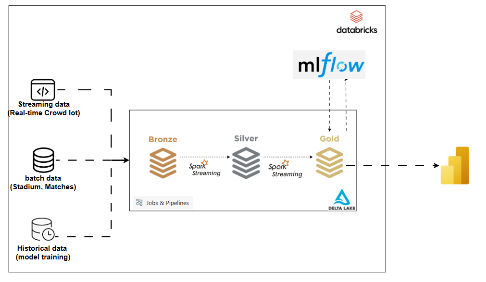

# CAN 2025: Incremental Streaming Analytics Pipeline

### **Predicting High-Risk Matches for Crowd Safety and Security**
**Author:** EL RHERBI MOHAMED AMINE  
**Event:** Student Challenge 2025 - Special Edition CAN (Morocco)

---

## 📋 Project Overview
This project implements an **Incremental Streaming Analytics Pipeline** designed for the **Africa Cup of Nations (CAN) 2025** in Morocco. The primary goal is to predict match risk levels in real-time by analyzing crowd density, ticketing velocity, and environmental factors.

By leveraging predictive management, organizers can proactively deploy security and medical resources, helping to prevent historical stadium incidents and ensuring a safe experience for fans.

---



## ⚡ Incremental Streaming vs. Continuous Streaming

This pipeline is built using **Triggered Incremental Streaming** (Spark Structured Streaming with `availableNow=True`). Unlike traditional 24/7 continuous streaming, this method processes only the data that has arrived since the last run.

### **Why it’s better for the CAN 2025 Project:**

| Feature | Continuous Streaming | **Incremental Streaming (This Project)** |
| :--- | :--- | :--- |
| **Cost** | 💸 **High**: Clusters must run 24/7 even if no match is happening. | 💰 **Low**: Clusters only spin up to process new sensor bursts, then shut down. |
| **Latency** | Milliseconds. | Seconds to Minutes (Perfect for match-day updates). |
| **Resources** | Consumes compute power constantly. | High efficiency; processes only the "deltas" (new data). |
| **Maintenance** | Requires constant monitoring for long-running jobs. | More robust; easier to orchestrate via Databricks Workflows. |

### **Key Benefits:**
1. **Cost Efficiency:** Since Africa Cup of Nations matches happen at specific times, we don't need to pay for 24/7 compute. The pipeline "wakes up," processes the latest crowd/weather data, and stops.
2. **Scalability:** It handles "spiky" data perfectly—such as the massive surge of ticketing and sensor data 30 minutes before kickoff—without requiring a massive permanent infrastructure.
3. **Reliability:** By using Delta Lake checkpoints, the pipeline ensures **Exactly-Once** processing. If a job fails, it resumes exactly where it left off, never processing the same risk event twice.

## 🏗️ Architecture: Medallion Design
The pipeline follows the **Medallion Architecture** to ensure data reliability and scalability using **Databricks**, **Spark Structured Streaming**, and **Delta Lake**.

### **1. Bronze Layer (Raw Data)**
Ingests raw data from both batch and simulated streaming sources.
* **Batch Data:** Static tournament info (Matches, Stadiums, and Historical Rivalry Scores).
* **Streaming Data:** Real-time simulations of ticketing percentages, crowd pressure sensors, and weather risks.

### **2. Silver Layer (Enriched Context)**
Unifies and cleans the data. It joins streaming events with batch metadata (stadium capacity, match phase) and calculates an **Importance Score** based on the tournament stage (e.g., Finals vs. Group Stage).

### **3. Gold Layer (Business & Prediction)**
* **Business Risk Score:** Computes a weighted risk index based on business logic.
* **ML Inference:** Uses a **Random Forest** model (managed via **MLflow**) to predict "High," "Medium," or "Low" risk levels for incoming real-time data.

---

## 🛠️ Technical Stack
* **Platform:** Databricks (Lakehouse Architecture)
* **Engine:** PySpark & Spark Structured Streaming
* **Storage:** Delta Lake & Unity Catalog
* **ML Lifecycle:** MLflow (Experiment tracking, Model Registry)
* **Orchestration:** Databricks Workflows

---

##  Project Structure
```text
CAN_RISK_PIPELINE/
├── 01_bronze/
│   ├── 01_generate_batch_data.py   # Populates Matches, Stadiums, and Rivalries (Batch)
│   └── generate_stream_data.py      # Simulates real-time crowd/weather sensors (Stream)
├── 02_silver/
│   └── build_silver_context.py     # Joins batch/stream and calculates importance scores
├── 03_gold/
│   ├── compute_gold_risk_score.py  # Manual business logic risk calculation
│   └── gold_realTime_inference.py  # Real-time ML model prediction and label assignment
├── create medallion.py             # Database and Schema initialization
└── model_training.py               # MLflow training pipeline for Random Forest Classifier
```

## Key Insights & Business Impact
Optimized Resource Management: Efficient deployment of security and medical teams based on predicted risk levels.

Enhanced Fan Experience: Reduction in crowd bottlenecks through data-driven flow management.

Cost Efficiency: The pipeline uses Incremental/Triggered Streaming, ensuring the cluster processes data only when needed, minimizing cloud costs.

Proactive Safety: Identifying high-risk scenarios before they escalate into incidents.